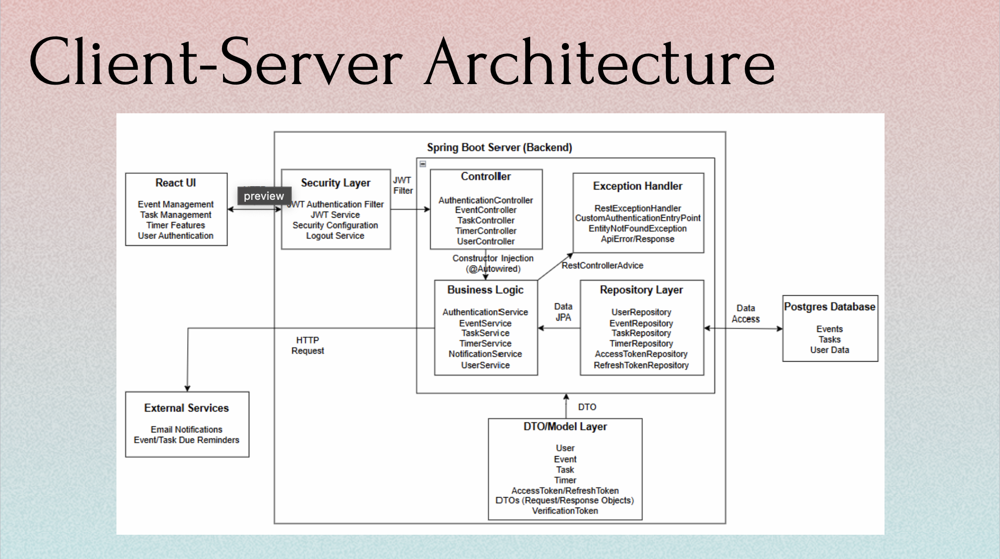
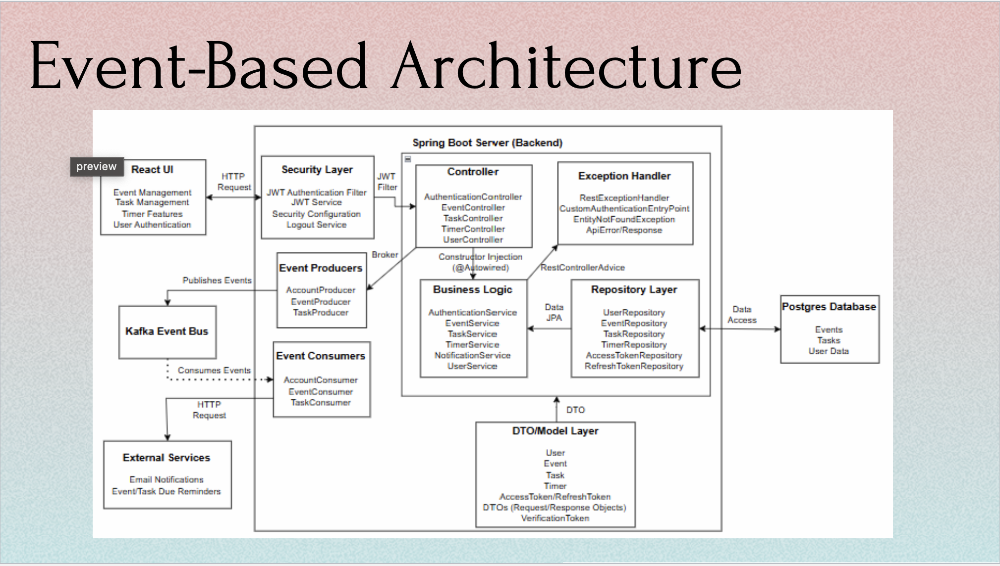

# HASK TASK API DOCUMENTATION:

## Table of Contents

- [Project Group 1](#project-group-1)
- [Introduction](#introduction)
- [Modular Design for Scalability](#modular-design-for-scalability)
- [Getting Started](#getting-started)
- [API Endpoints](#api-endpoints)
    - [Create Task](#create-task)
    - [Get Task](#get-task)
    - [Update Task](#update-task)
- [Authentication](#authentication)
- [Development Setup](#development-setup)
- [Kafka Configuration](#kafka-configuration)
- [Error Handling](#error-handling)
- [Testing](#testing)
- [Difference between Client-Server and Event Based Architecture](#difference-between-client-server-and-event-based-architecture)
- [Our Rationale for Choosing Event-Based Architecture](#our-rationale-for-choosing-event-based-architecture)
- [Client-Server Architecture Diagram](#client-server-architecture-diagram)
- [UML Diagram (Client-Server) for Hask Task App](#uml-diagram-client-server-for-hask-task-app)
- [Event Based Architecture](#event-based-architecture)
- [UML Diagram (Event Based Architecture)](#uml-diagram-event-based-architecture)

# Project Group 1
> Members: 
> - Hiren Bagga, 
> - Anthony Stephen Aryee, 
> - Kailong Duan

## Introduction

The Hask Task API allows you to manage tasks and notifications. You can create events, tasks, update them, and monitor
their
status through notifications.
> [API Endpoints Documentation Link] (http://localhost:8080/swagger-ui/index.html)<br>
> [CHECK IF SERVER IS UP OR DOWN] (http://localhost:8181/actuator/health)

## Modular Design for Scalability:

This structure follows best practices for modular design and separation of concerns,
allowing the backend and frontend to scale efficiently as the project grows.
Each component is encapsulated in its own package or directory, making the codebase
easier to maintain, extend, and test.

```markdown
    src
    └── main
        │
        ├── resources
        │   ├── application.yml # Main application configuration
        │   │   └── application-dev.yml # Development environment configuration
        │   └── template
        │
        └── java
            └── com
                └── hask
                    └── hasktask
                        │
                        ├── config
                        │   ├── ApplicationConfig.java # General application configurations
                        │   ├── JwtAuthenticationFilter.java # JWT Authentication filter
                        │   ├── OpenAPIConfig.java # OpenAPI (Swagger) configurations
                        │   ├── SecurityConfig.java # Security configurations (Spring Security, CORS, etc.)
                        │   └── services
                        │       ├── JWTService.java # Handles JWT token generation/validation
                        │       └── LogoutService.java # Handles user logout
                        │
                        ├── controller
                        │   ├── AuthenticationController.java # Handles login, registration, etc.
                        │   ├── EventController.java # Manages event-related API calls
                        │   ├── TaskController.java # Manages task-related API calls
                        │   ├── TimerController.java # Manages timer-related API calls
                        │   └── UserController.java # Manages user-related API calls
                        │
                        ├── model
                        │   ├── AccessToken.java # Model for access tokens
                        │   ├── AuthenticateRequest.java # DTO for authentication request
                        │   ├── EmailConfirmation.java # Email confirmation model
                        │   ├── ChangePasswordRequest.java # DTO for password change request
                        │   ├── Event.java # Event entity/model
                        │   ├── JWTResponse.java # JWT token response DTO
                        │   ├── VerificationToken.java # Model for verification tokens
                        │   ├── RefreshToken.java # Refresh token model
                        │   ├── RegisterRequest.java # DTO for user registration
                        │   ├── Timer.java # Timer entity/model
                        │   ├── Task.java # Task entity/model
                        │   └── User.java # User entity/model
                        │
                        ├── service
                        │   ├── AccessTokenService.java # Handles access token-related logic
                        │   ├── AuthenticationService.java # Handles authentication-related business logic
                        │   ├── VerificationTokenService.java # Handles email confirmation logic
                        │   ├── EventService.java # Handles event-related business logic
                        │   ├── EventDueReminder.java # Handles event due reminders
                        │   ├── TaskDueReminder.java # Handles task due reminders
                        │   ├── NotificationService.java # Handles notification sending logic
                        │   ├── RefreshTokenService.java # Handles refresh token-related logic
                        │   ├── RoleService.java # Handles roles/permissions logic
                        │   ├── TaskService.java # Task-related business logic
                        │   ├── TimerService.java # Timer-related business logic
                        │   ├── TokenType.java # Defines token types (e.g., access, refresh)
                        │   └── UserService.java # Handles user-related business logic
                        │
                        ├── repository
                        │   ├── AccessTokenRepository.java # Repository for AccessToken entity
                        │   ├── EventRepository.java # Repository for Event entity
                        │   ├── VerificationTokenRepository.java # Repository for verification tokens
                        │   ├── RefreshTokenRepository.java # Repository for RefreshToken entity
                        │   ├── TaskRepository.java # Repository for Task entity
                        │   ├── TimerRepository.java # Repository for Timer entity
                        │   └── UserRepository.java # Repository for User entity
                        │
                        │ # Event and Lister Directories are for Kafka (Event-Driven Architecture)
                        ├── event
                        │   ├── EventProducer.java # Kafka producer for sending events
                        │   ├── TaskProducer.java # Kafka producer for sending task events
                        │   └── AccountProducer.java # Kafka producer for account-related events
                        │
                        ├── listener
                        │   ├── EventConsumer.java # Kafka consumer for event processing
                        │   ├── TaskConsumer.java # Kafka consumer for task processing
                        │   └── AccountConsumer.java # Kafka consumer for account-related events
                        │
                        └── customException
                            ├── CustomAccessDeniedHandler.java # Handles 403 (access denied) errors
                            ├── CustomAuthenticationEntryPoint.java # Handles 401 (unauthorized) errors
                            ├── CustomNotFound.java # Custom exception for 404 errors
                            ├── EntityNotFoundException.java # Custom exception for entity not found
                            ├── GeneralException.java # General exception handler
                            ├── RestExceptionHandler.java # Global exception handler for REST APIs
                            └── apiError
                                ├── ApiError.java # Generic API error response model
                                ├── ApiErrorResponse.java # API error response structure
                                └── ApiValidationError.java # Validation error handling
````

````aiignore
---

### 🔗 Connectors by Directory:

---

### 🛡️ `kafka` 
**Purpose**: Event producers and consumers

| Class                          | Connects To                                                                 | Connector(s)                                   |
|--------------------------------|-----------------------------------------------------------------------------|------------------------------------------------|
| `EventProducer.java`           | Kafka producer, event topics, and serializers                               | `KafkaTemplate`, `ProducerRecord`, `send()`    |
| `TaskProducer.java`            | Kafka producer, event topics, and serializers                               | `KafkaTemplate`, `ProducerRecord`, `send()`    |
| `AccountProducer.java`         | Kafka producer, event topics, and serializers                               | `KafkaTemplate`, `ProducerRecord`, `send()`    |
| `EventConsumer.java`           | Kafka consumer, event topics, and deserializers                             | `@KafkaListener`, `ConsumerRecord`, `listen()` |
| `TaskConsumer.java`            | Kafka consumer, event topics, and deserializers                             | `@KafkaListener`, `ConsumerRecord`, `listen()` |
| `AccountConsumer.java`         | Kafka consumer, event topics, and deserializers                             | `@KafkaListener`, `ConsumerRecord`, `listen()` |
| `EventDueReminder.java`        | Event processing logic for reminders                                        | `@Scheduled`, `KafkaTemplate`, `send()`        |
| `TaskDueReminder.java`         | Task processing logic for reminders                                         | `@Scheduled`, `KafkaTemplate`, `send()`        |
| `NotificationService.java`     | Sends notifications based on events                                         | `@Autowired`, method calls                     |


### 🛡️ `config`  
**Purpose**: Cross-cutting concerns like security, app config, filters

| Class                          | Connects To                                                                          | Connector(s)                                                          |
|--------------------------------|--------------------------------------------------------------------------------------|-----------------------------------------------------------------------|
| `JwtAuthenticationFilter.java` | `SecurityContext`, `AuthenticationService`, `JWTService`, and indirectly Controllers | `OncePerRequestFilter`, `SecurityContextHolder`, `doFilterInternal()` |
| `SecurityConfig.java`          | JWT filter, auth rules, endpoints                                                    | `SecurityFilterChain`, `HttpSecurity`, `AuthenticationManager`        |
| `ApplicationConfig.java`       | Beans for services, password encoder, etc.                                           | `@Configuration`, `@Bean`                                             |
| `OpenAPIConfig.java`           | Swagger documentation                                                                | `@Configuration`, Swagger/OpenAPI DSL                                 |

---

### 🔐 `config/services`  
**Purpose**: Auth-related services

| Class                | Connects To                                                                 | Connector(s)                                       |
|--------------------- |-----------------------------------------------------------------------------|----------------------------------------------------|
| `JWTService.java`    | Used by `JwtAuthenticationFilter`, `AuthenticationService`, `LogoutService` | Method calls, dependency injection                 |
| `LogoutService.java` | Tied to logout endpoint & token blacklisting                                | Called from security logout handlers or controller |

---

### 🎮 `controller`  
**Purpose**: API entry points

| Class                                 | Connects To                                            | Connector(s)                         |
|---------------------------------------|--------------------------------------------------------|--------------------------------------|
| `AuthenticationController.java`, etc. | Services (like `AuthenticationService`, `UserService`) | `@Autowired` / constructor injection |
|   JWT filter (indirectly)             | Filter chain via Spring Security                       |                                      |
|   Exception handler                   | `@ControllerAdvice`, exception propagation             |                                      |

---

### 📦 `model`  
**Purpose**: Domain and DTO objects

| Class                                        | Connects To Services, Repositories, Controllers                | Used directly via method arguments/returns |
|----------------------------------------------|----------------------------------------------------------------|--------------------------------------------|
| `AuthenticateRequest`, `User`, `Event`, etc. | Controllers use DTOs as inputs; services handle domain objects | Jackson mapping, JPA entities              |

---

### 🧠 `service`  
**Purpose**: Business logic

| Class                              | Connects To                                    | Connector(s)                        |
|------------------------------------|------------------------------------------------|-------------------------------------|
| `UserService`, `TaskService`, etc. | Repositories                                   | `@Autowired`, constructor injection |
|  Controllers                       | Service methods invoked from controller        |                                     |
| Exception handlers                 | Throw exceptions like `EntityNotFoundException`|                                     |

---

### 🏪 `repository`  
**Purpose**: Data access layer

| Class                                       | Connects To                                       | Connector(s)                                                |
|---------------------------------------------|---------------------------------------------------|-------------------------------------------------------------|
| All `*Repository.java`                      | Services                                          | Spring Data JPA (`JpaRepository`, method naming convention) |
|                                             | `@Repository`, `@Autowired`                       | Spring automatically wires these interfaces                 |

---

### ⚠️ `customException`  
**Purpose**: Error handling

| Class                                                   | Connects To                                    | Connector(s)                                       |
|---------------------------------------------------------|------------------------------------------------|----------------------------------------------------|
| `RestExceptionHandler.java`                             | Global error handling for controllers/services | `@ControllerAdvice`, `@ExceptionHandler`           |
| `CustomAccessDeniedHandler.java`                        | Security layer                                 | Used in `SecurityConfig` via `.exceptionHandling()`|
| `EntityNotFoundException.java`, `GeneralException.java` | Thrown in services                             | Propagates to controller → handler                 |

---

### 🧩 Summary Table of Key Connectors

| Layer                               | Connected To                               | How (Connector)                              |
|-------------------------------------|--------------------------------------------|----------------------------------------------|
| **Controller ↔ Service**            | Business logic                             | Constructor injection (`@Autowired`)         |
| **Service ↔ Repository**            | Data access                                | Spring Data JPA                              |
| **Controller ↔ Exception Handling** | Error responses                            | `@ControllerAdvice`, `@ExceptionHandler`     |
| **JWT Filter ↔ SecurityContext**    | Auth token → user                          | `SecurityContextHolder`, `doFilterInternal()`|
| **SecurityConfig ↔ JWT Filter**     | Register filter                            | `http.addFilterBefore(...)`                  |
| **Controller ↔ DTOs/Models**        | Data input/output                          | Spring MVC binding, Jackson                  |
| **Service ↔ Custom Exceptions**     | Error signaling                            | Java exception throwing                      |

````

> Controllers:

- The EventController, TaskController, UserController, AuthenticationController, etc., are the main REST controllers
  responsible for handling incoming API requests and forwarding them to the respective services.

> Service Layer:

- The service layer handles the business logic. For example, EventService, TaskService, UserService,
  NotificationService, etc., contain the core logic for processing events and handling notifications.

> Repositories:

- Each repository (EventRepository, TaskRepository, UserRepository, AuthenticationRepository) is responsible for data
  persistence. These correspond to your JPA repositories for managing entities.

> Event Processing:

- The consumers (like EventConsumer, TaskConsumer, etc.) handle the processing of events when they are consumed from
  Kafka topics. They perform actions such as sending notifications, updating tasks or events, etc.

> Notification Service:

- After consuming an event, a NotificationService might be responsible for sending out notifications (e.g., reminders,
  task completions) to the users.

## Hask Task API Documentation:

Welcome to the Hask Task API! This document serves as a guide for developers to understand how to interact with the API,
the available endpoints, and how to use them effectively.

## Getting Started

0. Kindly ensure you have the following prerequisites installed:
> BACKEND:
-
    - IntelliJ IDEA or any Java IDE for development
    - Java 17 or higher
    - Open-JDK 19 or higher
    - Maven
    - Kafka (for event-driven architecture)
    - PostgreSQL (database)
    - Postman or any API client for testing
    - Git for version control
    - Swagger UI (for API documentation)
    - All Dependencies are included in the `pom.xml` file
> Server Configuration (in resources directory):
-
    - All backend config in the `application.yml` and `application-dev.yml` files
      - a. Spring Security configuration
      - b. JWT authentication
      - b. CORS configuration
      - c. Swagger UI configuration
      - d. Kafka configuration
      - e. Database configuration
      - f. Logging configuration
      - g. Email configuration 
      - 
> FRONTEND:
-
    - Node.js and npm (for ReactJS frontend)
-

## Development Setup

###### -----------------BACKEND:--------------------
1. Clone the repository:
    ```bash
    git clone https://github.com/your-repo/hask-task.git
    ```
    ---or---
    ```bash
    git clone https://github.com/your-repo/hask-task.git
    ```

2. Navigate to the project directory:

   ```bash
   cd hask-task
   ```
2.1. Create a PostgreSQL database:

   - Create a new database named `hask_task` in PostgreSQL.
   - Update the `application-dev.yml` file with your PostgreSQL database credentials.

   - Example configuration in `application-dev.yml`:
   ```yaml
   spring:
     datasource:
       url: jdbc:postgresql://localhost:5432/hask_task
       username: postgres
       password: postgres1
   ```
3. Kafka Configuration:

The application uses Kafka for event-driven architecture. A Kafka consumer listens for events on the `task-events`
topic. When a task is marked as completed, an event is produced and consumed by the API.

### Events:

- **TASK_COMPLETED:** When a task is marked as completed, the event is sent, and notifications are triggered.

    - Download and unzip Kafka from the [Apache Kafka website](https://kafka.apache.org/quickstart).
    - Rename the unzip folder to `kafka_server`.
    - Change directory(cd) into the `kafka_server` folder.
      ```bash
      cd kafka_server
      ```
        - Generate a Cluster UUID for the Kafka server:
          ```bash
          KAFKA_CLUSTER_ID="$(bin/kafka-storage.sh random-uuid)"
          ```
            - Format Log Directories for the Kafka server:
              ```bash
              bin/kafka-storage.sh format --standalone -t $KAFKA_CLUSTER_ID -c config/server.properties
              ```
            - Run the following command to start Kafka server:
              ```bash
              bin/kafka-server-start.sh config/server.properties
              ```
    - DEBUG ONLY: TO READ THE EVENTS: Open a new terminal. Then run the following command:
        ```bash
        bin/kafka-console-consumer.sh --topic hask-task-app --from-beginning --bootstrap-server localhost:9092
        ```
    - By default, Kafka server runs on `localhost:9092`.

4. Install dependencies (if using Maven):

   ```bash
   mvn clean install
   ```

5. Start the application:

   ```bash
   mvn spring-boot:run
   ```

## API Endpoints

### Create Task

- Complete Usage & Description of Endpoint (Swagger UI): [http://localhost:8080/swagger-ui/index.html](http://localhost:8080/swagger-ui/index.html)
- **Endpoint:** `POST /api/v1/tasks`
- **Description:** Creates a new task.
- **Example Request Body:**
   ```json
   {
     "taskName": "Task Name",
     "dueDate": "2025-03-20T18:08:05.549Z",
     "userId": "User ID",
     "taskDescription": "Task description",
     "isCompleted": false,
     "isReminderSent": false
  }
   ```
- **Response:**
    - `200 OK`: Task created successfully.
    - `400 Bad Request`: Invalid input.

### Get Task

- **Endpoint:** `GET /api/v1/tasks/{taskId}`
- **Description:** Retrieves the details of a task by its ID.
- **Path Parameter:**
    - `taskId` (required): The ID of the task you want to retrieve.
- **Response:**
    - `200 OK`: Task retrieved successfully.
    - `404 Not Found`: Task not found.

### Update Task

- **Endpoint:** `PUT /api/v1/tasks/{taskId}`
- **Description:** Updates an existing task.
- **Path Parameter:**
    - `taskId` (required): The ID of the task to update.
- **Request Body:**
   ```json
   {
     "taskName": "Updated Task Name",
     "description": "Updated description",
     "dueDate": "2025-03-22T14:00:00",
     "isCompleted": true
   }
   ```
- **Response:**
    - `200 OK`: Task updated successfully.
    - `400 Bad Request`: Invalid input.
    - `404 Not Found`: Task not found.

## Authentication

The API uses Spring Security to handle user authentication. The application requires a user to be authenticated before
performing any operations. Ensure that the user is logged in using JWT or other authentication methods.

For JWT-based authentication, include the token in the `Authorization` header:

```
Authorization: Bearer {JWT_TOKEN}
```

## Error Handling

Errors are returned in a standard format:

```json
{
  "status": "error",
  "message": "Error message describing the issue",
  "details": "Additional details (optional)"
}
```

### Common Error Codes:

- `400 Bad Request`: Invalid input data.
- `404 Not Found`: Resource not found.
- `500 Internal Server Error`: Server error, please try again later.
- `401 Unauthorized`: Authentication required.
- 
4. Use Postman(any API client) or Our Swagger-UI mentioned above to interact with the API.

-------------------------------------
###### -----------------FRONTEND:--------------------


1. Clone the frontend repository:
    ```bash
    git clone https://github.com/your-repo/hask-task.git
    ```
2. Navigate to the frontend directory: (Run the ReactJS frontend application to interact with the API.)

   ```bash
   cd hask-task-frontend
   ```
3. Install dependencies:

   ```bash
    npm install
    ```
4. Start the ReactJS application:
    ```bash
   npm start
   ```
5. Open your browser and navigate to `http://localhost:3000` or your default port `http://localhost:default-port` to access the frontend application.
6. Sign up or log in to the application using the credentials you created during the backend setup.
7. OTP
    - The OTP will be sent to the email address you provided during registration.
    - Enter the OTP in the application to verify your email address.
    - Once verified, you can start using the application to create tasks, set timers, and manage events.
8.
    - The application will send notifications to your email address for task reminders and event updates.

#### Testing (After testing, we excluded the test classes from the final build)
- Testing is done using JUnit and Mockito for unit tests.
- Integration tests are done using Spring Boot Test.
- For frontend testing, we used Jest and React Testing Library.


## Difference between Client-Server and Event Based Architecture
> **Client-Server Architecture**: the client (ReactJS app) directly communicates with the server (Spring Boot API) using HTTP requests (REST or GraphQL). The server is the central point that handles most of the logic, data storage, and authentication.
> The client sends requests to the server, and the server responds with the requested data or performs actions based on the request.

>**Event-Based Architecture**: the client and server communicate through events. The server publishes events to a message broker (like Kafka), and the client subscribes to these events. This allows for asynchronous communication, where the client can react to events without waiting for a direct response from the server.
> The server can also process events in the background, allowing for better scalability and decoupling of components.

### Client-Server vs Event-Based Architecture
```aiignore
| Criteria         | Client-Server (REST-Based)     | Event-Based (Event-Driven)      |
|------------------|--------------------------------|---------------------------------|
| Simplicity       | Easy to grasp                  | Steeper learning curve          |
| Background Jobs  | Needs external support         | First-class fit                 |
| Testing          | Lightweight                    | More setup required             |
| Scalability      | Limited without rework         | Horizontal-ready                |
| Local Dev        | Fast & minimal                 | Heavy & slower                  |
| UX Responsiveness| Blocking                       | Non-blocking                    |
| Debugging        | Straightforward                | Requires tracing tools          |
```

### Pros and Cons of Client-Server

> ### Pros:
    - Simple and predictable: The request/response model is easy to understand, making debugging and tracing straightforward.
    - Low latency: Locally, REST calls are fast, eliminating most network-related latency issues.
    - Secure and controlled: Integrating authentication (e.g., JWT) and authorization (e.g., role-based access) is straightforward using middleware.
    - Well-defined API boundaries: The separation between frontend and backend is clean and well-defined via HTTP contracts.
    - Easy to test: Endpoints can be tested independently using tools like Postman, Insomnia, or curl, without the need to simulate event brokers or async flows.

> ### Cons:
    - Synchronous behavior: Requires clients to wait for a response, which can block the UI. For tasks like reminders or calendar syncs, this delay hampers user experience.
    - Additional work for background jobs: Naturally doesn’t handle deferred or scheduled execution. Features like reminders or scheduled tasks often require Kafka or cron, increasing architectural sprawl.
    - Boilerplate for CRUD operations: A lot of endpoints may simply mirror basic database operations, potentially leading to repetitive code, whereas Kafka-based solutions can sometimes handle these more elegantly via event consumers.


### Pros and Cons of Event-Based

> ### Pros:
    - Loose coupling: Services communicate via events rather than direct calls, allowing them to evolve independently.
    - Built for background tasks: Event-based flows work very well for asynchronous processes like timers, scheduled task reminders, and notifications, taking full advantage of Kafka’s durability.
    - Asynchronous performance: Events can be triggered without waiting for a response, keeping the UI responsive even when working with background processes on a local setup.
    - Design to Scale: The decoupled nature of event-driven systems makes them inherently more scalable.

>### Cons:
    - Resource Intensive: ZooKeeper (or KRaft mode), brokers, and often schema registries or Kafka Connect— all of which can eat up CPU, memory, and disk I/O on a local machine.
    - Debugging challenges: Tracing the flow of asynchronous events can be difficult without proper logging or monitoring tools, making it harder to pinpoint issues.
    - Testing complexity: Unit and integration tests must handle asynchronous behavior with Kafka, often requiring event mocking or the use of test containers.
    - Overkill for Devs: If your primary use case is simple, or if only a single instance runs locally for testing, Kafka might introduce more complexity than value.
    - Startup Time: Initial setup and service boot can noticeably delay development cycles, especially in environments where quick iteration is preferred.

### Our Rationale for Choosing Event-Based Architecture
    - The Hask Task API & UI is designed to be modular and scalable, allowing for easy integration of new features and services.
    - The event-based architecture allows for better handling of background tasks, such as reminders and notifications, without blocking the user interface.
    - The use of Kafka allows for better scalability and decoupling of components, making it easier to manage and maintain the application as it grows.
    - The event-driven approach allows for better handling of asynchronous processes, making the application more responsive and efficient.

### Client-Server Architecture Diagram
- 

### UML Diagram (Client-Server Architecture)
- 

### Event Based Architecture Diagram
- 


### UML Diagram (Event Based Architecture)
- 


# Thanks for using the Hask Task API!
